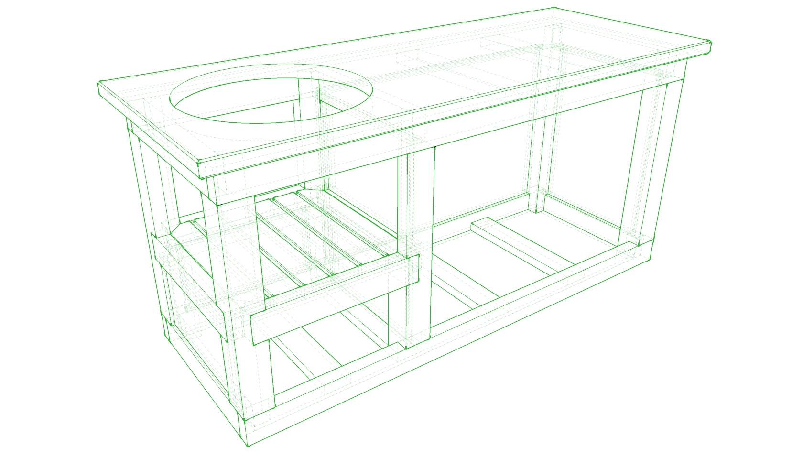

# 1. Page de Couverture

- **Titre** : Fabrication et assemblage du Meuble pour Big Green Egg Large
  
- **Informations** : 
  - Nom de l'entreprise : Wood Twenty
  - Adresse e-mail : contact@toogz.fr
  - Site web : [toogz.fr](http://toogz.fr/#)

# 2. Table des Matières

1. Page de Couverture
2. Table des Matières
3. Description Générale
4. Liste des Pièces et Matériaux
5. Outils Nécessaires
6. Instructions d’Assemblage
7. Schémas et Plans Techniques
8. Détails des Assemblages
9. Finitions
10. Entretien et Maintenance
11. Informations Légales

# 3. Description Générale

- **Nom du Meuble** : Meuble pour Big Green Egg Large
- **Dimensions Globales** :
  - Longueur : 190 cm
  - Largeur : 70 cm
  - Hauteur : 85 cm
- **Usage** : Table de jardin robuste conçue pour accueillir un barbecue Big Green Egg, avec des étagères pour le rangement des accessoires.
- **Matériaux Principaux** : 
    * Poteaux Douglas Qualité C24 95x95mm & 95x45mm
    * Contreplaqué Okoumé Marine 10mm
    * Quinquaillerie (Glissières/Vis/Poignée/Roulettes)
    * Colle à bois PU
    * Finition (Fondur + Vernis)

# 4. Liste des Pièces et Matériaux

| Numéro de Pièce | Description de la Pièce | Dimensions (L x l x h) | Quantité | Matériaux |
|-----------------|-------------------------|------------------------|----------|-----------|
| 1               | Plateau supérieur       | 150 x 60 x 3 cm        | 1        | Teck      |
| 2               | Pieds                   | 90 x 10 x 10 cm        | 4        | Teck      |
| 3               | Étagère inférieure      | 140 x 50 x 2 cm        | 1        | Teck      |
| 4               | Support grill           | 50 x 50 x 3 cm         | 1        | Acier     |
| ...             | ...                     | ...                    | ...      | ...       |

# 5. Outils Nécessaires

- Scie sous table
- Scie a onglets
- Perceuse
- Visseuse
- Tournevis
- Marteau
- Scie à bois
- Mètre ruban
- Équerre de menuisier

# 6. Instructions d’Assemblage

## Etape 1 : Préparation des Pièces

- **Description** : Découper toutes les pièces selon les dimensions fournies.
- **Illustration** : 
- **Conseils Pratiques** : Utiliser une scie de précision pour des coupes nettes.

## Etape 2 : Assemblage du Cadre

- **Description** : Fixer les pieds au plateau supérieur.
- **Illustration** : 
- **Conseils Pratiques** : Vérifier l’équerrage avant de visser.

...

# 7. Schémas et Plans Techniques

## Vue de Face

- 
- **Cotes et Dimensions** : Longueur, largeur, hauteur indiquées.

## Vue de Côté

- 
- **Cotes et Dimensions** : Largeur, hauteur indiquées.

## Vue de Dessus

- 
- **Cotes et Dimensions** : Longueur, largeur indiquées.

## Vue Éclatée

- 
- **Annotations** : Indications des fixations et des perçages.

# 8. Détails des Assemblages

- **Joints et Fixations** : Types de joints (tenon-mortaise, tourillons, etc.) et fixations (vis, clous, etc.).
- **Zoom sur les Zones Clés** : Schémas agrandis des zones critiques.

# 9. Finitions

- **Préparation des Surfaces** : Ponçage, apprêt, etc.
- **Application de la Finition** : Instructions pour la peinture, le vernissage, l’huilage, etc.

# 10. Entretien et Maintenance

- **Conseils** : Nettoyage régulier, protection contre les intempéries, etc.

# 11. Informations Légales

- **Garantie** : Détails de la garantie offerte (1 an, 2 ans, etc.).
- **Mentions Légales** : Informations sur la propriété intellectuelle, les brevets, les marques déposées, etc.

---

**Format et Présentation**

- **Police de Caractère** : Arial, Calibri, ou Times New Roman.
- **Taille de Police** : 10 à 12 points pour le corps du texte, plus grande pour les titres.
- **Couleurs** : Utiliser des couleurs sobres et professionnelles.
- **Mise en Page** : Marges standard, en-têtes et pieds de page cohérents.
- **Fichiers** : Plan en format PDF pour une présentation uniforme.

