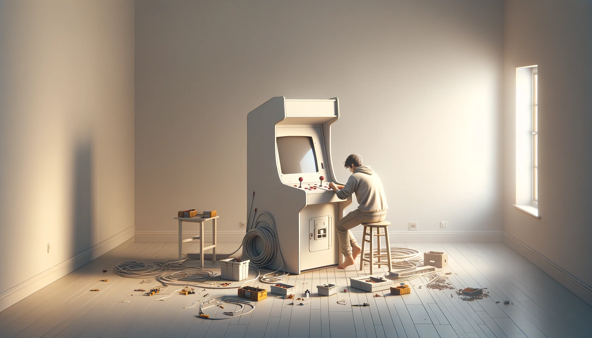

## Introduction

### Présentation du projet

une borne d'arcade ravive non seulement la flamme de la nostalgie pour les amateurs de jeux rétro, mais elle représente également un projet personnel captivant, mêlant défi technique, créativité et passion pour le jeu. Ces bornes, emblématiques des salles d'arcade qui ont marqué les décennies passées, offrent une expérience de jeu inégalée, plongeant les joueurs dans un univers ludique et créant une ambiance conviviale.

Le projet de créer de ses propres mains une borne d'arcade est motivé par diverses raisons. Pour certains, c'est la quête de revivre des moments emblématiques de leur jeunesse, de réintroduire le frisson des compétitions amicales sur des classiques comme "*Street Fighter*", "*Pac-Man*" ou encore "*Metal Slug*" dans le confort de leur foyer. Pour d'autres, il s'agit d'un défi personnel, une opportunité d'apprendre et de maîtriser de nouvelles compétences en électronique, en programmation ou en menuiserie.

Ayant déjà conçu et réalisé deux bornes d'arcade (une petite 1 joueur, ecran 9,7 pouces 4:3 d'iPad et une 19 pouces, toujours en 4:3 mais 2 joueurs), chaque projet a été une aventure d'apprentissage, me permettant d'affiner mes compétences en menuiserie, en électronique et en programmation. Ces expériences précédentes ont été essentielles pour faire mes armes, me confrontant à divers défis et me poussant à explorer de nouvelles solutions techniques et créatives.

Cette nouvelle borne d'arcade n'est donc pas un simple projet. Elle est le fruit de tout ce que j'ai pu apprendre au fil de mes constructions et recherches précédentes. Et de tout ce que j'ai encore apprendre ici. Elle incarne l'accumulation de connaissances techniques et d'astuces de bricolage acquis lors de la réalisation de mes premières machines. Chaque erreur passée, chaque succès, a contribué à forger une vision plus affinée et ambitieuse pour ce projet.

Outre la satisfaction personnelle et le défi technique, cette borne se veut être un concentré d'innovation et de personnalisation. Elle reflétera non seulement ma passion pour les jeux d'arcade classiques, mais aussi mon évolution en tant que créateur. Avec un design pensé pour deux joueurs, elle promet des moments de partage et de compétition, rappelant les jours glorieux des salles d'arcade, tout en intégrant des fonctionnalités modernes qui témoignent des avancées technologiques et des préférences actuelles en matière de gaming.

Au-delà du jeu, c'est un projet créatif, un élément de décoration qui apporte une touche unique et personnelle à l'espace de vie. Chaque choix de design, chaque composant sélectionné, est une décision longuement réfléchie qui allie esthétique et fonctionnalité, faisant de cette borne une œuvre d'art interactive et un hommage à l'age d'or du jeu vidéo.

Dans cette nouvelle aventure, je compte non seulement à repousser les limites de ce que j'ai pu réaliser auparavant, mais aussi à partager a ma petite échelle cette expérience avec la communauté des amateurs d'arcade.

---

### Aperçu des principaux défis

#### Défis Techniques

Le cœur du projet repose sur sa réussite technique. Cela inclut :

* **La Sélection des Composants :** Choisir les bonnes pièces (écran, hardware informatique, système d'exploitation, contrôleurs, son) qui sont compatibles entre elles et adaptées aux jeux que vous souhaitez jouer.
* **La Programmation et Configuration :** Installer et configurer le logiciel, les émulateurs et les jeux, tout en s'assurant que le système est stable et réactif.
* **L'Assemblage Physique :** Concevoir une structure solide et fonctionnelle, intégrer l'électronique de manière sécurisée et ergonomique, posant un défi particulier en termes de câblage et de disposition des composants.

#### Défis Esthétiques

L'apparence de la borne est tout aussi cruciale que sa fonctionnalité :

* **Design de la Borne :** Créer un design qui soit à la fois fidèle à l'esprit des arcades classiques et adapté aux goûts personnels et à l'environnement où la borne sera installée.
* **Personnalisation et Finitions :** Sélectionner des matériaux, des couleurs, et des artworks qui non seulement rendent hommage aux jeux classiques mais qui reflètent également une touche personnelle unique.
* **Ergonomie :** S'assurer que la borne est confortable pour deux joueurs, ce qui implique une réflexion approfondie sur les dimensions, la hauteur des contrôleurs, et l'angle de vue de l'écran.

#### Défis Financiers

Le budget est une considération incontournable, avec plusieurs facteurs à prendre en compte :

* **Coût des Composants :** L'acquisition de pièces de qualité (écran, carte mère, contrôleurs) peut rapidement devenir coûteuse.
* **Gestion du Budget :** Balancer les aspirations du projet avec un budget réaliste, ce qui peut nécessiter des compromis sur certains aspects ou une recherche approfondie pour trouver les meilleures offres.
* **Coûts Inattendus :** Prévoir une marge pour les dépenses imprévues, qu'il s'agisse de pièces supplémentaires ou de modifications nécessaires en cours de route.

Face à ces défis, il est important d'avoir une planification minutieuse, une recherche approfondie et une flexibilité pour s'adapter aux imprévus. La compréhension et l'anticipation permettront de naviguer plus facilement à travers le processus de création, transformant les défis en opportunités d'apprentissage.

---

## 1. Planification et Conception

### Définir les Objectifs du Projet

* **Sélection des jeux :** Déterminer les types de jeux désirés (classiques, combats, plateforme, etc.) pour orienter le choix du matériel.

  > * Depuis les débuts de l'arcade "moderne" (pac-man en gros) jusqu'a pourquoi pas la génération PS3 / Switch ( Voir [Configuration Hardware](#le-système-darcade) )
  > * Jeu horizontal (bandes noires pour les jeux tate - voir pour faire aussi une borne only Tate :/ )
  > * Pas de jeux spinner. ( Joystick 8-Way / 6 btn d'actions / 1 btn START / 1 btn coins ) x 2 joueurs
  > * Guncab ( 2 Lightguns) + Emetteur IR
  > * Pincab ?!? ( 2 btn flippers / 1 btn tirette )

* **Expérience utilisateur :** Réflexion sur l’expérience de jeu (écran unique ou multiples, système sonore, etc.).

  > * Jeux 1 ou 2 joueurs
  > * Ecran 27 pouces 1440p
  > * Son 2.1 ( 2x150W + Caisson )
  > * Reglage son
  > * Environnement lumineux ( boutons panel / bandeaux led rgb => "Ambilight" [*Jacky_Mode=True*])
  > * Marquee Lumineux ( leds )
  > * Monnayeur fonctionnel ( voir le montant - Yves si tu nous regarde !)
  > * Jukebox Mode ? ( sujet a creuser )
  > * Acces Rapide Clavier (Christian on pense à toi !) & Souris
  > * Manettes ?!? ( Fil, Bluetooth ? )

### Conception et Plans

#### Dimensions ergonomiques pour deux joueurs.

  > * Réflexions sur les dimensions optimales pour la borne
  > * Inclinaison de l'écran 27 pouces
  > * Orientation idéales enceintes et caisson
  > * Espacement entre les joueurs

#### Élaboration des plans de la borne.

  > * Regroupement de toutes les idées et pré-requis
  >   Esquisses, Rough
  > * Mise en 3D du design final ( probablement sur Fusion 360 )
  

#### Design et personnalisation esthétique.

  > * Choix du theme et des codes couleurs - Inspirations ( Pinterest )
  > * Création des designs des vinyls ( Photoshop )
  > * Adaptation (création ?) d'un thême Launchbox à celui de la borne ? 

---

## 2. Sélection des Composants

### L’Écran et l’Affichage

* Taille, type (LCD, LED), résolution, orientation (portrait ou paysage).

  > * Ecran 27 pouces 16:9 QHD (Oled ? :dollars)
  > * 2560 x 1440 ( 6 x 240p )
  > * Paysage ( bezels pour jeux 4:3 ? )

### Le Système d’Arcade

* Options de plateforme (PC, Raspberry Pi, console modifiée).

  > * PC nu ( pas de boitier ) 

* Logiciels et systèmes d’exploitation (Windows, Linux, RetroPie).

### Les Contrôleurs
* Types de contrôles (joysticks, boutons, trackballs).
* Configuration pour deux joueurs.

### Le Son
* Système audio, choix des haut-parleurs et de l'amplificateur.

### Autres Composants
* Alimentation, éclairage LED, décoration.

---

## 3. Construction

### Fabrication du Corps
* Découpe et assemblage du bois, méthodes et matériaux recommandés.
* Installation de l'écran, du système sonore, et des ventilateurs de refroidissement.

### Montage des Contrôleurs
* Placement et fixation des boutons et joysticks.

### Finitions et Personnalisations
* Peinture, vinyle, et décoration personnalisée.

---

## 4. Installation et Configuration Logicielle

### Montage Électronique
* Câblage interne, connexion des contrôleurs, de l'écran, et du système audio.

### Configuration Logicielle
* Installation du système d’exploitation, des émulateurs, et des jeux.
* Mappage des contrôleurs.

### Tests et Ajustements
* Essais de fonctionnement, débogage, optimisation des performances.

---

## 5. Finalisation et Lancement

### Révision Générale
* Vérification de la sécurité, de l'ergonomie, et de la fonctionnalité.

### Première Utilisation
* Organisation d'une session inaugurale, feedback des utilisateurs.

### Maintenance et Mises à Jour
* Conseils pour l'entretien, les mises à jour logicielles, et l'ajout de nouveaux jeux.

---

## Conclusion

### Retour d’Expérience
* Satisfaction personnelle, réactions des proches et visiteurs.

### Évolutions Possibles
* Ajouts futurs, modifications, extensions communautaires.

---

## Annexes
### Ressources Utiles

**Sites Web :**
* [Building a home Arcade Machine | retroMASH](https://retromash.com/2015/01/02/building-a-home-arcade-machine-part-1/)
* [Building your own Arcade Cabinet for Geeks | Scott Hanselman](https://www.hanselman.com/blog/building-your-own-arcade-cabinet-for-geeks-part-1-the-cabinet)
*[Arcade Controls](http://www.arcadecontrols.com)

**PDF :**
* [Project Arcade: Build Your Own Arcade Machine.](files/Project-Arcade-Build-Your-Own-Arcade-Machine.pdf)
    
---
